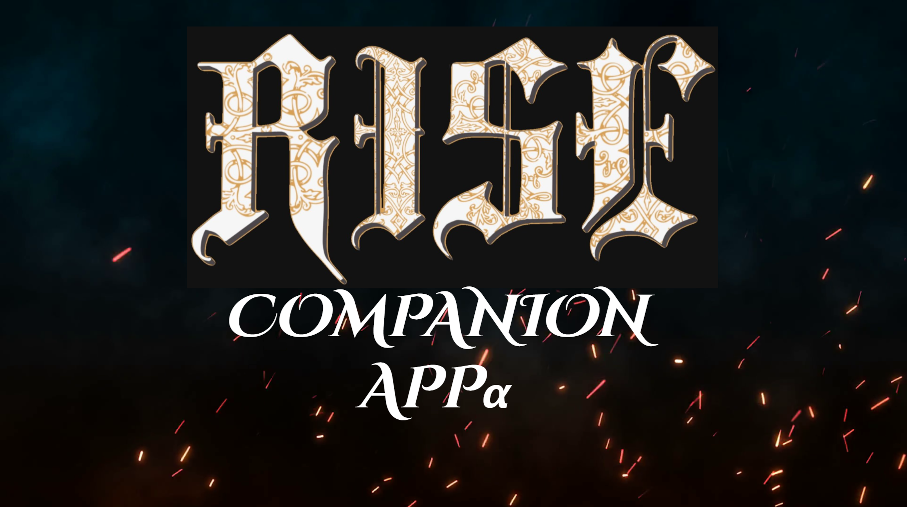

# Rise Companion App

### [Live Site] https://stormy-mountain-53373.herokuapp.com/

-----------
# Description
This is the Rise Companion App repository. This app will be used to accompany players of the Rise System. It will act as a Character creator and will have dice rollers to facilitate in game play. This is a work in progress and I would consider this the alpha version of the app, just out of design and wireframing. 
-----------

## Tech/Framework

* The full MERN Stack - MongoDB, Express.js, React, and Node
* React
* Next.js
* stylized-components
* React-Bootstrap

-----------
## Authors and Acknowledgment
* Nick Skinner
* I'd like to thank the UC Davis coding bootcamp team for answering all my questions regarding this project.

-----------
## Known Errors
* Does not create a new user instance when Signup is initiated

-----------
## License
Copyright [2021] [##Authors]

Licensed under the Apache License, Version 2.0 (the "License");
you may not use this file except in compliance with the License.
You may obtain a copy of the License at

    http://www.apache.org/licenses/LICENSE-2.0

Unless required by applicable law or agreed to in writing, software
distributed under the License is distributed on an "AS IS" BASIS,
WITHOUT WARRANTIES OR CONDITIONS OF ANY KIND, either express or implied.
See the License for the specific language governing permissions and
limitations under the License.